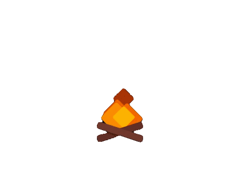

---

Eu sou um estudante na área de front-end como de back-end do Brasil. Uso principalmente Phyton, Java e SpringBoot, mas estou aberto a aprender novas tecnologias e diferentes desafios.

  

<h3>Sobre mim</h3>

 

- 💻 Atualmente estou trabalho em projetos voltados para autenticação de usuários com o foco de melhorar minhas habilidades de programação e arquitetura de projeto

 

- 🌱 Aprendendo WebSockets e aprimorando minhas habilidades de desenvolvimento web com projetos.

  

---

 

  

 

---

  
  

 

  

